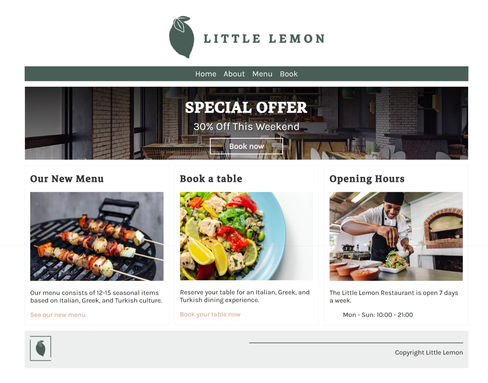
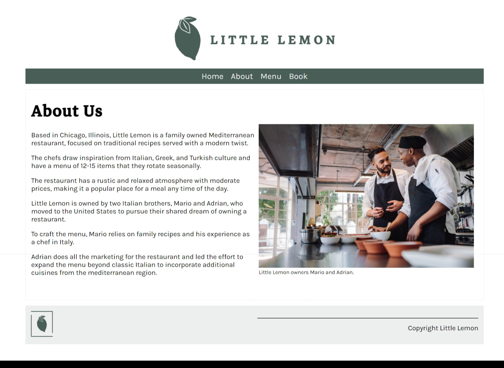
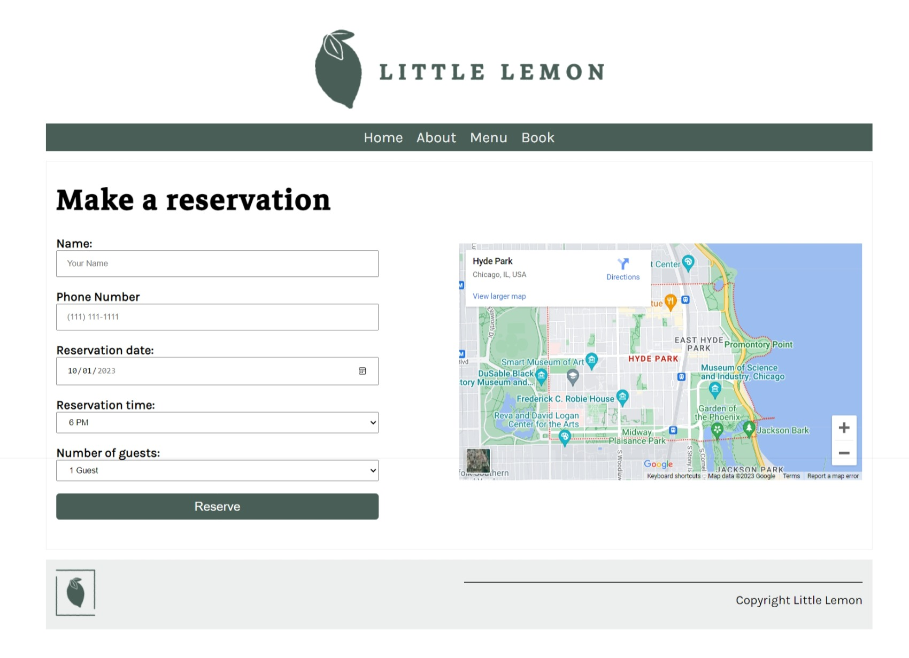
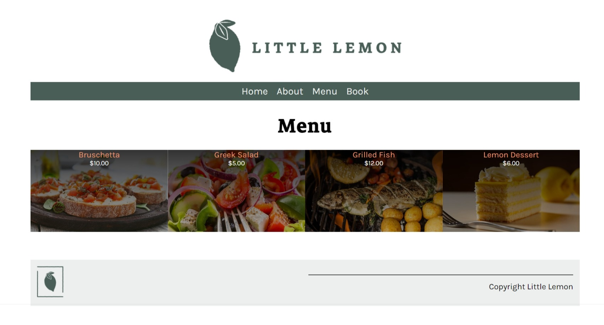
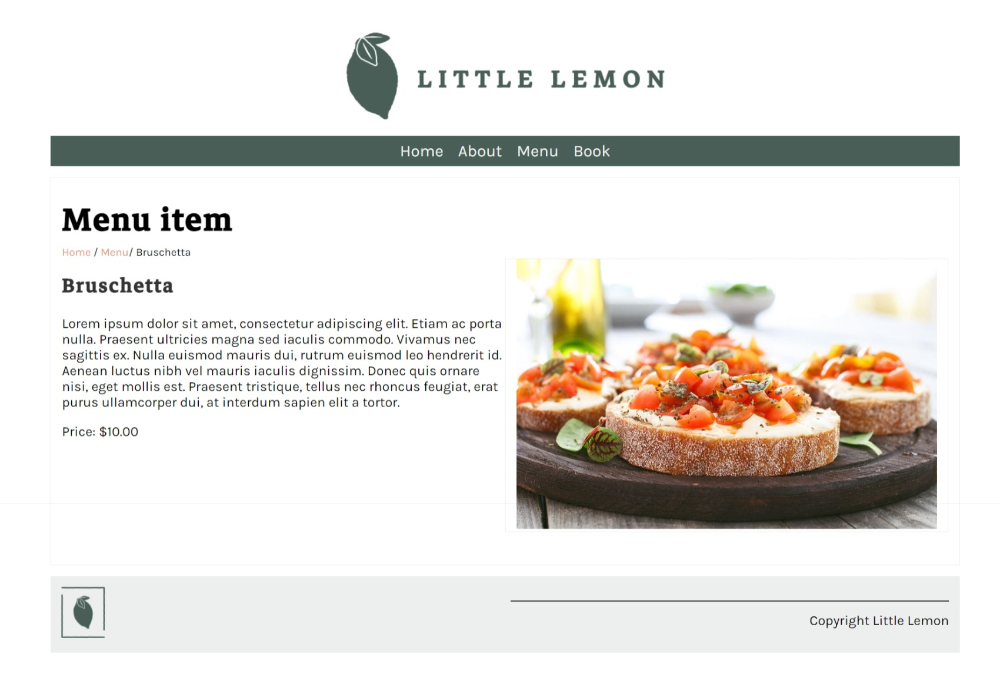

# Little Lemon Website 

This repository contains the source code for a restaurant website built using Django. The website provides several key features to users, including the ability to view the restaurant's menu, make reservations, and learn more about the restaurant. Below, we provide an overview of the main functionalities implemented in this code.

## Features

### Home Page
- The `home` view displays the restaurant's opening and closing hours.Links to the menu and booking page. Users can access this information on the homepage.

   

### About Page
- The `about` view provides users with information about the restaurant. It serves as a brief introduction to the establishment.

   

### Booking Page
- The `book` view allows users to make reservations by submitting a booking form. Users can input details such as their name, reservation date, reservation hour, phone number, and the number of guests.

   

### Menu Page
- The `menu` view displays the restaurant's menu items. Users can browse the menu to view available dishes and their descriptions.

   

### Menu Item Details Page
- The `display_menu_item` view allows users to view details of a specific menu item. Users can access this page by selecting a menu item from the menu page.

   

### Bookings API
- The `bookings` view is an API endpoint that handles reservation-related operations:
  - Users can make reservations by sending a POST request with booking details in JSON format.
  - The API checks for existing reservations and validates the input data.
  - It provides information about the availability of reservations for a specified date, including the number of reservations per hour and maximum capacity constraints.

